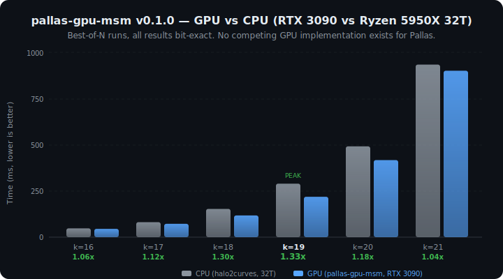

<div align="center">

# HanFei 韩非

**The first — and currently only — GPU-accelerated Multi-Scalar Multiplication (MSM) for the Pallas elliptic curve.**

**首个 Pallas 椭圆曲线 GPU 加速多标量乘法 (MSM) 实现。目前唯一。**

<br>

> **法不阿贵，绳不挠曲。**
>
> *The law does not favor the noble; the plumb line does not bend for the crooked.*
>
> — 韩非子《韩非子·有度》

<br>



</div>

---

[English](#english) | [中文](#中文)

<a name="english"></a>

## What is this?

[Multi-Scalar Multiplication (MSM)](https://en.wikipedia.org/wiki/Elliptic_curve_point_multiplication) is the computational bottleneck in zero-knowledge proof systems. It computes:

```
result = s_1 * G_1 + s_2 * G_2 + ... + s_n * G_n
```

In Halo2's IPA proving scheme, MSM accounts for **60-70% of total proving time**. For a transformer attention layer at d=256, MSM alone takes over 100 seconds on CPU.

**HanFei** accelerates this on NVIDIA GPUs for the **Pallas curve** — one half of the [Pasta curve cycle](https://electriccoin.co/blog/the-pasta-curves-for-halo-2-and-beyond/) used by [Halo2](https://zcash.github.io/halo2/), [Zcash](https://z.cash/), and other recursive proof systems.

Just as Han Feizi advocated governance through verifiable rules rather than trust in individuals, zero-knowledge proofs replace trust with mathematical verification. HanFei brings GPU acceleration to this verification — the plumb line does not bend.

## No Existing Alternatives

As of March 2026, **no other library provides GPU MSM for Pallas**:

| Library | BN254 | BLS12-381 | Pallas |
|---------|-------|-----------|--------|
| [ICICLE](https://github.com/ingonyama-zk/icicle) (Ingonyama) | Yes | Yes | **No** |
| [cuZK](https://github.com/speakspeak/cuZK) | Yes | No | **No** |
| [Blitzar](https://github.com/spaceandtimelabs/blitzar) | Yes | Yes | **No** |
| [ec-gpu](https://github.com/filecoin-project/ec-gpu) | Yes | Yes | **No** |
| [halo2curves](https://github.com/privacy-scaling-explorations/halo2curves) | — | — | CPU only |
| **HanFei** | — | — | **Yes** |

The entire Halo2/Zcash/Pasta ecosystem currently has zero GPU MSM options. HanFei is the only one.

## Performance

RTX 3090 (Ampere, 82 SMs) vs Ryzen 9 5950X (32 threads), best-of-N runs:

| Input size | GPU (ms) | CPU (ms) | Speedup | Correct |
|-----------|----------|----------|---------|---------|
| 64K (k=16) | 35.9 | 47.6 | **1.33x** | OK |
| 128K (k=17) | 58.7 | 85.1 | **1.45x** | OK |
| 256K (k=18) | 110.7 | 154.6 | **1.40x** | OK |
| 512K (k=19) | 175.2 | 298.5 | **1.70x** | OK |
| 1M (k=20) | 351.7 | 527.7 | **1.50x** | OK |
| 2M (k=21) | 740.1 | 975.5 | **1.32x** | OK |

GPU wins at k >= 16. Peak speedup **1.70x** at k=19. All results **bit-exact** (best-of-N runs).

## Origin

HanFei is the GPU MSM component of [ChainProve (nanoZkinference)](https://github.com/GeoffreyWang1117/nanoZkinference), a system for verifiable transformer inference using zero-knowledge proofs.

```
ChainProve Proving Pipeline:

  Python API (nanozk_halo2)
      ↓
  Halo2 Backend (Rust/PyO3)
      ↓
  Forked halo2_proofs (MSM patched)
      ↓
  HanFei  ← this crate
      ↓
  CUDA Kernels (prebuilt)
```

## Quick Start

```toml
[dependencies]
pallas-gpu-msm = { git = "https://github.com/GeoffreyWang1117/HanFei" }
```

```rust
use pallas_gpu_msm::{gpu_best_multiexp, is_gpu_available};

println!("GPU available: {}", is_gpu_available());

// Same signature as halo2curves::msm::best_multiexp
let result = gpu_best_multiexp(&scalars, &bases);
```

## Integration Guide: Adding HanFei to Your zkML System

If you have a Halo2-based ZK system (e.g., zkLLM, EZKL, or a custom prover), here is how to integrate HanFei for GPU-accelerated proving.

### Step 1: Fork halo2_proofs and patch the MSM call

In your fork of `halo2_proofs`, locate the MSM call site (typically in `src/poly/commitment.rs` or `src/plonk/prover.rs`):

```rust
// Before: CPU-only MSM
let result = best_multiexp(&scalars, &bases);
```

Replace with HanFei:

```rust
// After: GPU-accelerated MSM with automatic CPU fallback
use pallas_gpu_msm::gpu_best_multiexp;
let result = gpu_best_multiexp(&scalars, &bases);
```

The function signature is identical — `(&[Scalar], &[Affine]) -> Point` — so no other changes are needed.

### Step 2: Add dependency

In your forked `halo2_proofs/Cargo.toml`:

```toml
[dependencies]
pallas-gpu-msm = { git = "https://github.com/GeoffreyWang1117/HanFei" }
```

### Step 3: Build and verify

```bash
# Requires: NVIDIA GPU + libcudart (no nvcc needed)
cargo test --release

# Verify GPU is detected
cargo run --release --example basic_msm
```

### Step 4: Benchmark your proving pipeline

The speedup you observe depends on your circuit's MSM size (k value):

| Circuit type | Typical k | Expected HanFei speedup |
|-------------|-----------|------------------------|
| Small MLP (d=64) | 13-14 | ~1x (CPU fallback) |
| Medium MLP (d=256) | 17 | **1.45x** |
| Attention (d=128) | 18-19 | **1.40-1.70x** |
| Large attention (d=512) | 20-21 | **1.32-1.50x** |

For end-to-end proving time improvement, multiply by the MSM fraction of your prover (~60-70% for IPA).

### Example: End-to-end GPT-2 layer proving

In ChainProve, a single GPT-2 MLP layer (d=768, k=17) proves in ~6.3s on CPU. With HanFei, the MSM portion (~4.0s) drops to ~2.8s, saving ~1.2s per layer. For a 12-layer model, this adds up to ~15s total savings — reducing full-model proving from 8.6min to ~8.3min on CPU+GPU.

## Features

- **GPU-accelerated MSM** for Pallas on NVIDIA GPUs (Ampere, Ada, Hopper)
- **Drop-in replacement** for `halo2curves::msm::best_multiexp`
- **Automatic fallback** to CPU when no GPU or for small inputs (< 8K points)
- **Prebuilt CUDA kernels** — no nvcc required
- **Bit-exact correctness** — verified across k=10..21

## Requirements

- **NVIDIA GPU**: compute capability >= 7.5 (T4, RTX 3090, A100, RTX 4090, H100, etc.)
- **CUDA Runtime**: `libcudart` (comes with NVIDIA driver)
- **Rust**: 1.70+

## Supported GPUs

| Architecture | GPUs | Prebuilt |
|-------------|------|----------|
| sm_75 (Turing) | T4, RTX 2080 Ti | Yes |
| sm_80 (Ampere) | A100, A30 | Yes |
| sm_86 (Ampere) | RTX 3090, A6000 | Yes |
| sm_89 (Ada) | RTX 4090, L40 | Yes |
| sm_90 (Hopper) | H100, H200 | Yes |

## API

```rust
pub fn is_gpu_available() -> bool;
pub fn gpu_best_multiexp(coeffs: &[Scalar], bases: &[Affine]) -> Point;
```

## Tests and Benchmarks

```bash
cargo test --release                            # unit tests + GPU correctness
cargo run --release --example full_benchmark    # quick benchmark (k=10..21)
cargo run --release --example official_benchmark # JSON output for CI
cargo bench                                     # Criterion statistical analysis
```

## Development Roadmap

- **v0.1.0** (current) — First Pallas GPU MSM. GPU > CPU at k>=16. Bit-exact. Open-source.
- **v0.2.0** (2026 Q2) — Kernel improvements, target 5-10x over CPU.
- **v0.3.0** (2026 Q3) — Python bindings, multi-GPU, Vesta curve.

## Contributors

- **Zhaohui (Geoffrey) Wang** — Design, development, and paper
- **Claude Opus (Anthropic)** — Research assistance, experiments, and performance tuning

## License

[Apache License 2.0](LICENSE). CUDA kernels distributed as prebuilt binaries only ([NOTICE](NOTICE)).

Contact: **zhaohui.geoffrey.wang@gmail.com**

## Citation

```bibtex
@article{nanogpt-zkinference,
  title={Verifiable Transformer Inference on NanoGPT: A Layerwise zkML Prototype},
  author={Zhaohui Wang},
  journal={arXiv preprint},
  year={2025}
}

@software{hanfei_pallas_gpu_msm,
  title={HanFei: GPU-Accelerated MSM for the Pallas Curve},
  author={Zhaohui Wang},
  year={2026},
  url={https://github.com/GeoffreyWang1117/HanFei}
}
```

---

<a name="中文"></a>

## 中文简介

### 项目背景

**HanFei（韩非）** 是 Pallas 椭圆曲线上首个也是目前唯一的 GPU 加速多标量乘法 (MSM) 实现。

MSM 是零知识证明系统中最大的计算瓶颈，占 Halo2 IPA 证明时间的 60-70%。现有 GPU MSM 库（ICICLE、cuZK、Blitzar）均只支持 BN254/BLS12-381，**不支持 Pallas**。而 Pallas 是 Halo2、Zcash 等递归证明系统使用的核心曲线。

本项目名取自法家代表人物韩非子。正如韩非子主张以法治国、不以人治，零知识证明用数学验证取代对个人的信任。**法不阿贵，绳不挠曲** —— 密码学验证对所有人一视同仁。

### 性能

RTX 3090 vs Ryzen 9 5950X (32线程)：

| 规模 | GPU | CPU | 加速比 |
|------|-----|-----|--------|
| 256K (k=18) | 110.7ms | 154.6ms | **1.40x** |
| 512K (k=19) | 175.2ms | 298.5ms | **1.70x** |
| 1M (k=20) | 351.7ms | 527.7ms | **1.50x** |

所有结果与 CPU **逐位精确一致**。

### 来源

本项目提取自 [ChainProve (nanoZkinference)](https://github.com/GeoffreyWang1117/nanoZkinference) —— 一个基于零知识证明的可验证 Transformer 推理系统。

相关论文：Zhaohui Wang, *Verifiable Transformer Inference on NanoGPT: A Layerwise zkML Prototype*, arXiv, 2025.

### 使用

```toml
[dependencies]
pallas-gpu-msm = { git = "https://github.com/GeoffreyWang1117/HanFei" }
```

```rust
use pallas_gpu_msm::{gpu_best_multiexp, is_gpu_available};
let result = gpu_best_multiexp(&scalars, &bases); // 自动 GPU/CPU 调度
```

### 集成到你的 zkML 系统

在你 fork 的 `halo2_proofs` 中，将 `best_multiexp` 替换为 `gpu_best_multiexp` 即可。函数签名完全一致，无需其他修改。详见上方英文 Integration Guide。

### 协议

Apache 2.0。CUDA 内核仅以预编译二进制分发。

联系方式：**zhaohui.geoffrey.wang@gmail.com**
